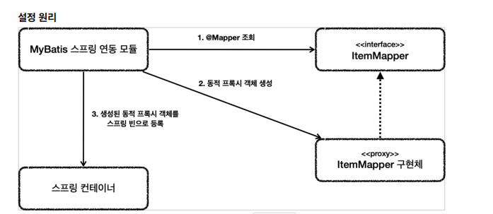

Insert SQL:
To use the Insert SQL, you can use <insert>.
For the id, you should specify the method name 
defined in the mapper interface.
In this case, the method name is save(),
so you can specify it as save.
The parameters can be handled using the #{} syntax,
and you should write the property name of the object 
passed from the mapper.
When using #{} syntax, it corresponds to using a PreparedStatement in JDBC, where ? is replaced with the values.

The useGeneratedKeys is used when the database employs the IDENTITY strategy to generate keys. keyProperty specifies the name of the attribute where the generated key is stored. After the Insert operation, the value of the generated key will be assigned to the id attribute of the item object.

Update SQL:
To use the Update SQL, you can use <update>. In this case, there are two parameters: Long id and ItemUpdateDto updateParam. If there is only one parameter, you don't need to specify @Param, but if there are multiple parameters, you need to use @Param to distinguish them.

Select SQL:
To use the Select SQL, you can use the ```<select>``` tag. 
The resultType specifies the return type, and in this case,
the results are mapped to the Item object. 
Thanks to the configuration in application.properties where mybatis.type-aliases-package=hello.itemservice.domain is specified, you don't have to write the full package name. If not, you would need to specify the complete package names.


Mybatis automatically converts underscores to camel case due to the mybatis.configuration.map-underscore-to-camel-case=true configuration (e.g., item_name becomes itemName).

When returning a single object from Java code, you can use Item or Optional<Item>. If you have multiple objects, you can use collections, usually List. Refer to the following for more details.

Mybatis supports convenient dynamic queries through syntax like <where> and <if>. <if> adds a clause if the condition is met, and <where> appropriately constructs the WHERE statement. In the example, if all <if> conditions fail, Mybatis does not create a WHERE statement. If at least one <if> condition succeeds, the first encountered and is transformed into WHERE.

XML Special Characters:
In the example, when comparing prices, you can observe the use of &lt;=, which represents <=. This is because XML doesn't allow special characters like < and > in data areas. Instead, you need to use their corresponding escape codes.

Here are some of the escape codes:
```
< : &lt;
> : &gt;
& : &amp;
```
Alternatively, you can use CDATA syntax provided by XML to use special characters within it. However, be aware that using CDATA might prevent certain features like <if> and <where> from working as expected.

You can choose the appropriate method (escape codes or CDATA) depending on your specific needs.
```
<select id="findAll" resultType="Item">
    select id, item_name, price, quantity
    from item
    <where>
        <if test="itemName != null and itemName != ''">
            and item_name like concat('%',#{itemName},'%')
        </if>
        <if test="maxPrice != null">
            <![CDATA[
            and price <= #{maxPrice}
            ]]>
        </if>
    </where>
</select>
```


There is no implementation for the ItemMapper mapper interface, so how did it work?

This part is automatically handled by the MyBatis Spring integration module, as follows:

1.During the application loading phase, the MyBatis Spring integration module scans interfaces annotated with @Mapper.
2.If such an interface is found, it dynamically creates an implementation for the ItemMapper interface using proxy technology.
3.The generated implementation is registered as a Spring bean."




the usage of proxies can be seen from the result of 

```
 log.info("itemMapper class={}", itemMapper.getClass());
```

which gives

```
itemMapper class=class com.sun.proxy.$Proxy66
```

dynamic proxy will be discussed later


**Mapper Implementation**
Thanks to the implementation of `ItemMapper` provided by the MyBatis Spring integration module, we can conveniently access and invoke data from XML using just an interface. Normally, when using MyBatis alone, we would have to go through more cumbersome code. However, with just one interface, we can achieve a clean and convenient solution.

The mapper implementation also handles exception conversion. It transforms exceptions thrown by MyBatis to Spring's exception abstraction, `DataAccessException`, making it easier to handle exceptions consistently. It provides exception conversion functionality similar to what `JdbcTemplate` offers.

**Summary:**
1. Thanks to the mapper implementation, we can seamlessly integrate MyBatis with Spring, making it more convenient to use.
2. Using the mapper implementation also enables the application of Spring's exception abstraction.
3. The MyBatis Spring integration module automatically configures various aspects, such as database connections, transactions, and synchronization, allowing them to work together with MyBatis.

> **Note:**
> For more details on the automatic registration done by the MyBatis Spring integration module, refer to the `MybatisAutoConfiguration` class.


## MyBatis Function Summary 1 - Dynamic Queries

In this section, we will briefly summarize some of the key features frequently used in MyBatis, based on the examples provided in the [official manual](https://mybatis.org/mybatis-3/ko/index.html).

**Dynamic SQL**

One of the primary reasons to use MyBatis is its powerful dynamic SQL feature. The functions provided for dynamic queries are as follows:

> 1. **if**

```xml
<select id="findActiveBlogWithTitleLike" resultType="Blog">
    SELECT * FROM BLOG
    WHERE state = ‘ACTIVE’
    <if test="title != null">
        AND title like #{title}
    </if>
</select>
```

This feature allows conditional addition of values based on the provided conditions. It uses OGNL (Object-Graph Navigation Language) syntax for internal expressions.

> 1.choose (when, otherwise)

```xml
<select id="findActiveBlogLike" resultType="Blog">
    SELECT * FROM BLOG WHERE state = ‘ACTIVE’
    <choose>
        <when test="title != null">
            AND title like #{title}
        </when>
        <when test="author != null and author.name != null">
            AND author_name like #{author.name}
        </when>
        <otherwise>
            AND featured = 1
        </otherwise>
    </choose>
</select>
```
This function is similar to the Java switch statement and provides a way to choose between multiple conditions.

> 2.trim (where, set)
```xml
<select id="findActiveBlogLike" resultType="Blog">
    SELECT * FROM BLOG
    WHERE
    <if test="state != null">
        state = #{state}
    </if>
    <if test="title != null">
        AND title like #{title}
    </if>
    <if test="author != null and author.name != null">
        AND author_name like #{author.name}
    </if>
</select>
```
The problem with this example is that it can cause issues when not all the conditions are satisfied. For example, SELECT * FROM BLOG WHERE title alone will cause problems. To address this, we can use <where> to handle dynamic conditions effectively.

> 3.foreach

```xml
<select id="selectPostIn" resultType="domain.blog.Post">
    SELECT *
    FROM POST P
    <where>
        <foreach item="item" index="index" collection="list"
                open="ID in (" separator="," close=")" nullable="true">
            #{item}
        </foreach>
    </where>
</select>
```
This feature is used when dealing with collections and makes it easy to construct statements like WHERE IN (1,2,3,4,5,6) when passing a List as a parameter.


Note: For more detailed information on dynamic queries, refer to the [official documentation](https://mybatis.org/mybatis-3/dynamic-sql.html).


** MyBatis Function Summary 2 - Other Features **
** SQL with Annotations **

Instead of using XML, you can write SQL directly in annotations like this:

```
@Select("select id, item_name, price, quantity from item where id=#{id}")
Optional<Item> findById(Long id);
```

Other annotations like @Insert, @Update, @Delete, and @Select are also available.
In this case, the corresponding XML tags, such as `<select id="findById">`, should be removed. However, it is recommended to use annotations only for simple cases, as dynamic SQL is not handled well with annotations.

For more details on writing SQL with annotations, refer to the <a href="https://mybatis.org/mybatis-3/dynamic-sql.html" >official documentation</a>

String Substitution

The #{} syntax uses prepared statements to bind parameters with ?. Sometimes, we may want to process the string as-is, rather than binding parameters. In such cases, ${} can be used. However, be cautious, as using ${} may expose your application to SQL injection attacks. Use it judiciously and with caution.

Reusable SQL Fragments

You can reuse SQL code using the ```<sql>``` tag:

```xml
<sql id="userColumns"> ${alias}.id,${alias}.username,${alias}.password </sql>

<select id="selectUsers" resultType="map">
    select
    <include refid="userColumns"><property name="alias" value="t1"/></include>,
    <include refid="userColumns"><property name="alias" value="t2"/></include>
    from some_table t1
    cross join some_table t2
</select>
```
The <include> tag allows you to include the SQL fragments defined with <sql>. You can also pass property values within the fragment.

Result Maps

When mapping results, you may encounter situations where column names differ from object properties. You can use aliases (AS) to address this directly:

```xml
<select id="selectUsers" resultType="User">
    select
    user_id as "id",
    user_name as "userName",
    hashed_password as "hashedPassword"
    from some_table
    where id = #{id}
</select>
```
Alternatively, you can use <resultMap> to declare mappings explicitly:

```
<resultMap id="userResultMap" type="User">
    <id property="id" column="user_id" />
    <result property="username" column="user_name"/>
    <result property="password" column="hashed_password"/>
</resultMap>

<select id="selectUsers" resultMap="userResultMap">
    select user_id, user_name, hashed_password
    from some_table
    where id = #{id}
</select>
```
Complex Result Mapping

MyBatis can handle complex result mappings that involve object associations. For this purpose, you can use <association>, <collection>, and other features. However, be aware that this can lead to complex performance and optimization issues. Exercise caution when using such features.

For more detailed information on result mapping, refer to the <a href="https://mybatis.org/mybatis-3/dynamic-sql.html" >official documentation.</a>